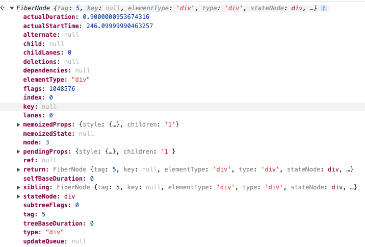
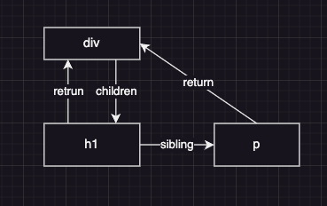

# 什么是虚拟DOM

> 只要可以用来描述Dom的数据结构都是虚拟Dom

换句话说 虚拟Dom可以是对象,数组,字符串...

## React中JSX和虚拟DOM

```jsx
  function App() {
    return (
      <div>
        <p>Hello</p>
      </div>
    )
  }
```

JSX只是React 虚拟Dom的一个语法糖

```jsx
  <div>222</div>
```

会被Babel编译为:

```js
import { jsx as _jsx } from "react/jsx-runtime";
/*#__PURE__*/_jsx("div", {
  children: "222"
});
```

最终返回一个对象, 返回的这个对象就是React的虚拟Dom

```tsx
console.log(<div>222</div>)
```

打印出来内容如下

```js
{
    $$typeof: Symbol(react.element),
    type: "div",
    key: null,
    ref: null,
    props: {
        children: "222"
    },
    "_owner": null,
    "_store": {}
}
```

React 的虚拟Dom其实就是一个普通对对象,

- `$$typeof`是一个用标识虚拟Dom的符号
- `type` 代表虚拟Dom对应的真实Dom类型 也有可能时React组件, Portal, Fragment...
- `key` 就是props上的key, 这个属性用来在Diff是判断是否需要更新
- `ref` 就是绑定的ref(React.useRef,React.createRef)
- `props` 就是给组件的传的props
  
可以定义一下虚拟Dom的类型

```ts
type VNode = {
  $$typeof: Symbol;
  type: string;
  key: string | null;
  ref: unknow | null;
  props: any
}
```

## 虚拟Dom和Fiber

上面说到只要时能够描述真实Dom的数据结构都是可被定义为虚拟Dom, 很明显Fiber也是虚拟Dom

在React 16之后放弃Stack架构使用Fiber架构, 为了区分我们使用`VNode`代表老版本的虚拟Dom, `Fiber`代表新的虚拟Dom

> 并不是说新版本的React就不存在`VNode`, babel仍然会将jsx编译为`VNode` 然后根据`VNode`生成`Fiber`, 至于为什么babel不直接将jsx编译为`Fiber`就不得而知了

可以在浏览器中打印`Fiber`的结构

可以看出比`VNode`的属性要多很多

简单介绍下几个比较重要的属性

- key 同 **`VNode`**
- type 同 `VNode`
- memoizedProps 记录之前的props (防止组件更新, props丢失)
- memoizedState 记录之前的state (防止组件更新, state被重置)
- flags 需要做的操作 替换(新增,插入,移动) 删除 更新
- child 子Fiber节点
- stateNode 对应的真实Dom
- alternate 之前的Fiber
- return 父级Fiber
- sibling 兄弟Fiber
  

Fiber使用过的事链表结构来表示每个Fiber的关系

例如:
```jsx
<div>
  <h1>Hi</h1>
  <p>Some Text</p>
</div>

```
会被表示为

